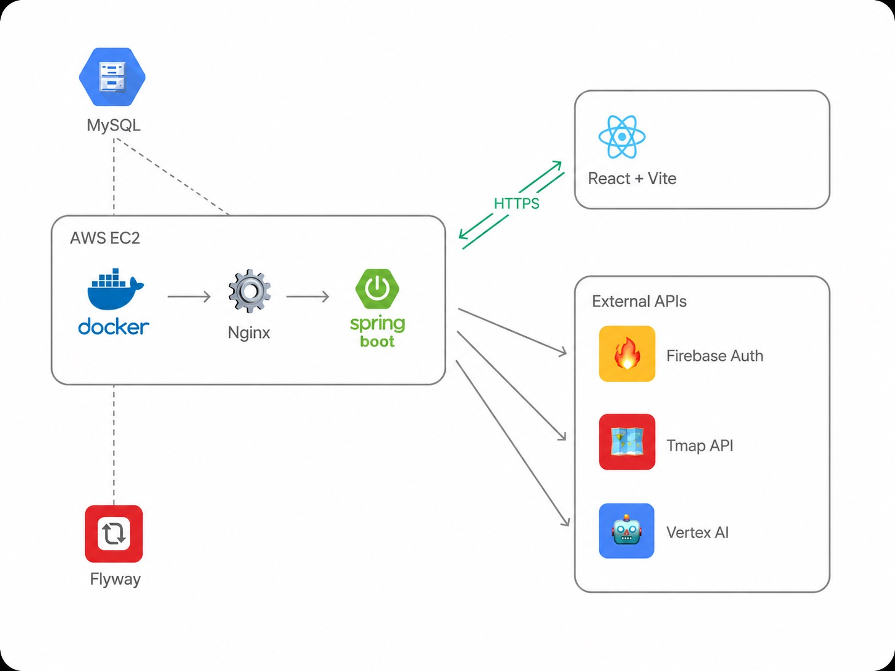
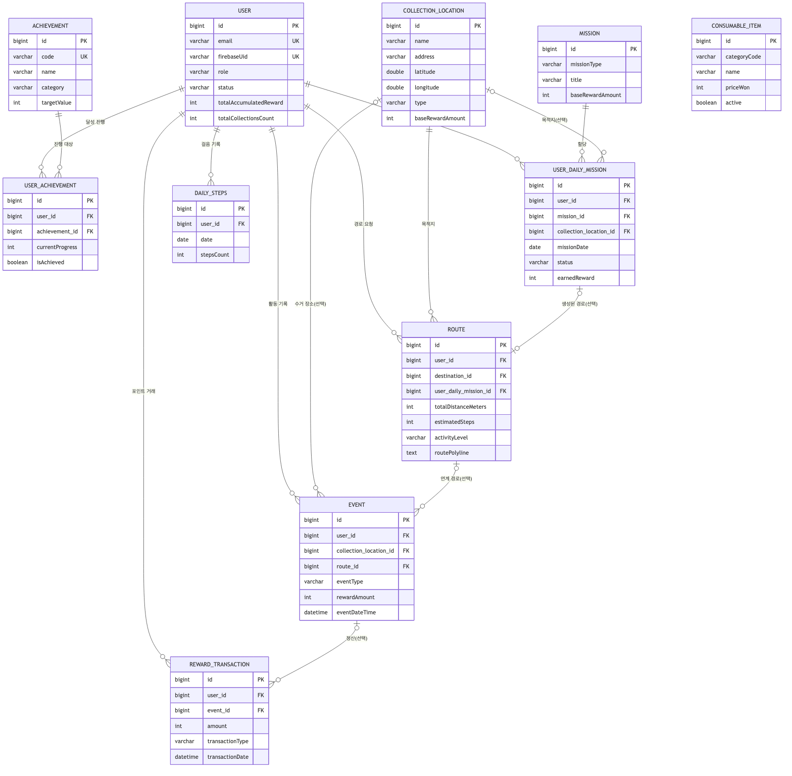

# Mediwalk-BE

사용자가 폐의약품 등 수거함까지 걸어가면 보상을 받는 앱 **mediwalk**의
백엔드입니다. Tmap 보행자 경로 API로 실제 걷기 좋은 경로를 생성하고, 일일 미션/업적, 포인트·
소모품 보상 경제를 제공합니다.

## 시연 영상

[https://www.youtube.com/shorts/AXX3TT8bUGo](https://www.youtube.com/shorts/AXX3TT8bUGo)

## 기술 스택

- Java 21 / Spring Boot 3.5
- Spring Web, Spring Data JPA, Spring Security(CORS/CSRF 설정 및 Firebase 토큰 인증), Validation
- MySQL 8 (+ Flyway, Java 기반 마이그레이션)
- Firebase Admin SDK (구글 로그인 토큰 검증)
- Google Cloud Vertex AI (의약품 이미지 검증)
- Tmap 보행자 경로 / 주변 POI 검색 API
- springdoc-openapi (Swagger UI)
- Apache POI (엑셀 기반 수거 위치 일괄 등록)
- Gradle, Docker / Docker Compose (EC2 배포)

## 아키텍처

### 전체 시스템 구성



- AWS EC2 위에서 Docker → Nginx → Spring Boot 순으로 요청을 처리하고, EC2 호스트에 설치된
  MySQL에 접속합니다 (컨테이너 내부에 MySQL을 띄우지 않음). Flyway가 MySQL 스키마를 관리합니다.
- 프론트엔드(React + Vite)와는 HTTPS로 통신합니다.
- 외부 API로 Firebase Auth(로그인 토큰 검증), Tmap API(보행자 경로/POI), Vertex AI(의약품
  이미지 검증)를 호출합니다.

### 패키지 구조

도메인 주도 패키지 구조로 나눴습니다. 컨트롤러/서비스/레포지토리/엔티티 계층을 도메인마다
분리하면 라우트 생성처럼 복잡한 로직과, 미션/보상처럼 단순 CRUD에 가까운 로직이 섞이지 않고
각자 응집도 있게 관리된다고 판단했습니다.

```
domain/
  auth/      - Firebase ID 토큰 로그인(구글 로그인) -> AuthLoginResponse
  user/      - User 엔티티/역할/상태
  mission/   - Mission, Achievement, UserDailyMission, UserAchievement
  reward/    - RewardTransaction(포인트), ConsumableItem 카탈로그, Event
  walk/      - 핵심 도메인: 경로 생성, Tmap 연동, CollectionLocation, POI, DailySteps
  common/    - BaseEntity(생성/수정일 감사), 공용 ErrorResponse
config/      - Security, CORS, OpenAPI/Swagger, Firebase Admin SDK, RestTemplate
exception/   - GlobalExceptionHandler (전역 예외 처리)
flyway/      - Java 기반 Flyway 마이그레이션
```

### ERD



- `EVENT`가 `COLLECTION_LOCATION`(수거 인증 장소), `ROUTE`(연계 경로), `REWARD_TRANSACTION`(정산)을
  잇는 허브 역할을 함 — 하나의 활동(수거/걷기)이 리워드로 이어지는 흐름을 하나의 로우로 추적
- `ROUTE`와 `USER_DAILY_MISSION`은 1:1(선택)로 분리 — 경로 생성은 미션 없이도 가능하고, 미션도
  경로 생성 없이 완료될 수 있어 강결합을 피함
- `CONSUMABLE_ITEM`은 아직 구매/보유 엔티티와 연결되지 않은 독립 카탈로그 테이블 (현재는 조회용)
- 모든 엔티티는 `BaseEntity`(`@MappedSuperclass`)를 상속해 `createdAt`/`updatedAt`을 공통으로 감사

## 설계 방식

**1. 에러 처리 — 설정 누락은 503, 예외는 한 곳에 집중**

- Tmap 키/GCP 인증정보는 환경마다 없을 수 있다고 가정 → 서버 기동 실패나 500이 아니라
  `IllegalStateException → 503 SERVICE_UNAVAILABLE`로 처리
- **이유**: 외부 연동 키가 없어도 미션/보상 등 나머지 API는 정상 동작 → 개발/테스트 편의성 확보
- 예외 처리를 도메인별로 흩어놓지 않고 `GlobalExceptionHandler` 하나로 통합 → 도메인이 늘어나도
  에러 응답 포맷(`ErrorResponse`)이 흔들리지 않게 함
- 메시지 문자열로 상태코드를 추론하는 대신 `NotFoundException`/`ForbiddenException`/
  `ConflictException`처럼 의미별 전용 예외 타입을 두고 각각 `@ExceptionHandler`를 연결 →
  서비스 코드가 "무슨 에러인지"를 타입으로 명시하고, 상태코드 매핑은 핸들러에만 존재

**2. 인증/인가 — Bearer 토큰 필터 + 역할 기반 + 리소스 소유자 검증 3단계**

- `FirebaseAuthenticationFilter`(`OncePerRequestFilter`)가 `Authorization: Bearer <Firebase ID
  토큰>` 헤더를 검증해 `SecurityContext`에 인증 정보를 채움. 토큰이 없거나 검증에 실패해도
  예외를 던지지 않고 익명 상태로 다음 필터로 넘김 — 인증 필요 여부 판단은 `SecurityConfig`의
  경로별 규칙에 위임
- `SecurityConfig`에서 회원가입(`POST /api/users`), 로그인(`/api/auth/**`)을 제외한 나머지
  `/api/**`는 기본적으로 인증을 요구하고, 사용자 목록 조회/삭제·수거함 등록/삭제·경로 등록처럼
  관리 성격의 엔드포인트는 `hasRole("ADMIN")`으로 별도 제한
- 역할 기반 제어만으로는 "내 데이터만 조회/수정" 같은 요구를 표현할 수 없어, `{id}` 단위 리소스
  API(업적 진행도, 일일 미션, 이벤트, 리워드 거래, 걸음 수, 경로 등)에는 `OwnershipGuard`로
  요청자 ID와 리소스 소유자 ID를 비교하는 검증을 컨트롤러 계층에 추가 (ADMIN은 예외)
- **이유**: Spring Security의 URL 패턴 매칭은 "어떤 API를 호출할 수 있는가"까지만 표현
  가능하고 "어떤 데이터에 접근할 수 있는가"는 표현할 수 없어, 역할 기반 인가와 리소스 소유자
  검증을 분리된 계층으로 두었음

**3. 리워드 — 적립/환급 분리 + 원장(ledger) 구조**

- 적립(ACCUMULATION)과 환급(REFUND)을 하나의 `RewardTransaction` 테이블에 타입으로 구분해
  기록 → 잔액 변동 이력을 거래 원장처럼 추적 가능
- 적립은 이벤트 생성 시(`EventService`)에서만 자동 처리되도록 막고, 환급 API는 REFUND
  타입만 받도록 제한 → 중복 적립/임의 적립 조작 방지
- 환급 시 최소 금액(10,000원)과 사용자 잔액 검증을 거치고, 은행명/마스킹된 계좌번호를
  저장 → 실제 현금화(출금) 흐름을 반영
- **한계**: 잔액 갱신에 낙관적 락(`@Version`) 등 동시성 제어는 아직 없어, 동시 요청 시
  정합성 처리는 개선 과제로 남아있음

**4. 경로 위 POI 조회 — 병렬화하되, 병렬화하면 안 되는 곳은 그대로 유지**

- 경로 폴리라인을 샘플링한 지점마다, 마트/공원 카테고리마다 Tmap POI를 순차 호출하던 걸
  `CompletableFuture` + 전용 스레드풀(`tmapPoiExecutor`)로 병렬화 (최악의 경우 28회 순차
  블로킹 호출 → 동시 호출)
- 마트/공원 조회는 각자 내부적으로 `tmapPoiExecutor`에 다시 작업을 제출하므로, 이 둘을 같은
  풀에서 동시 실행하면 풀 고갈 시 데드락 위험 → 별도 풀(`routeSuggestionOuterExecutor`)로 분리
- **의도적으로 병렬화하지 않은 곳**: MAXIMUM 레벨의 `pickMaximumWithinTmapCap`은 3km 캡을
  만족하는 첫 후보를 찾으면 멈추는 조기 종료 구조라, 병렬화하면 불필요한 유료 Tmap 호출만
  늘어나 순차 유지

## 설치 및 실행

### 사전 준비

- JDK 21
- 로컬 MySQL, DB 이름 `mediwalk` (`jdbc:mysql://localhost:3306/mediwalk`)
- `src/main/resources/application-local.yaml` 생성 (git에서 제외됨, 패키징 시에도 제외)
  아래 값을 채워야 합니다.
  - `spring.datasource.password` (MySQL 비밀번호)
  - `firebase.enabled: true`, `firebase.project-id`, Firebase 서비스 계정 JSON 경로
  - Vertex AI 의약품 검증용 GCP 프로젝트/리전/엔드포인트, 인증 정보
  - `app.tmap.api-key` (Tmap 보행자 경로 API 키)

  Tmap 키나 GCP 인증 정보가 없어도 서버는 죽지 않고, 관련 기능만 `503 SERVICE_UNAVAILABLE`로
  응답합니다.

### 로컬 실행

```bash
./gradlew bootRun            # http://localhost:8080 에서 기동
```

### 빌드 / 테스트

```bash
./gradlew build              # 전체 빌드 (컴파일 + 테스트)
./gradlew test                # 전체 테스트
./gradlew test --tests "com.example.mediwalk_be.MediwalkBeApplicationTests"   # 단일 테스트
```

### API 문서 (Swagger)

로컬 기동 후 `http://localhost:8080/swagger-ui/index.html` 에서 확인할 수 있습니다.

## API 엔드포인트

| 도메인 | Base path | 컨트롤러 |
|---|---|---|
| Auth | `/api/auth` | `AuthController` (`POST /google`: Firebase ID 토큰 로그인) |
| Route | `/api/routes` | `RouteController` (`POST /generate`: Tmap 경로 생성) |
| Collection Location | `/api/collection-locations` | `CollectionLocationController` (`POST /import/xlsx`: 엑셀 일괄 등록, `/nearby`, `/search`) |
| Mission / Achievement | `/api/missions`, `/api/achievements` | `MissionController`, `AchievementController` |
| Daily Steps | `/api/daily-steps` | `DailyStepsController` |
| Medicine Verification | `/api/medicine-verifications` | `MedicineVerificationController` (Vertex AI 의약품 이미지 검증) |
| Reward Transaction | `/api/reward-transactions` | `RewardTransactionController` |

그 외 세부/부가 엔드포인트(User, User Achievement, User Daily Mission, Reward Main,
Consumable, Event 등)를 포함한 전체 스펙은 Swagger UI를 참고하세요.

## 배포

실제 서비스: [https://api.mediwalk.site](https://api.mediwalk.site)

Docker Compose 기반 배포 절차와 롤백 방법은 [DEPLOY.md](./DEPLOY.md)를 참고하세요.

## 작성자

- GitHub: [@hyojae02](https://github.com/hyojae02)
- Email: dsdk1088@gmail.com
